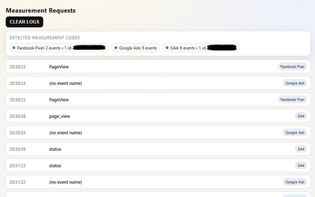
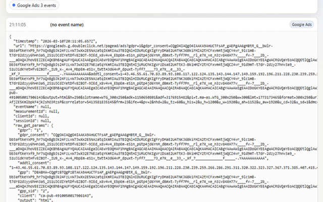

# GA4 Tracker DevTools Panel

A lightweight Chrome DevTools panel that surfaces measurement requests from GA4 and other common marketing pixels. It lists requests in a compact accordion view and highlights providers with distinct colors so you can quickly see what is firing on a page.





## What It Does
- Captures GA4 `/g/collect` and `/mp/collect` requests.
- Detects other common providers such as Facebook Pixel, TikTok Pixel, LinkedIn Insight, Pinterest Tag, X (Twitter), Microsoft UET, and Google Ads.
- Shows a summary bar with detected measurement IDs and total event counts per provider.
- Displays each request as a one-line entry (timestamp + event name) with expandable details.

## How It Works
The panel listens to Chrome DevTools network events and inspects request URLs and POST bodies. If a request matches a known provider pattern, it is listed and grouped by provider, and its measurement ID is tracked in the summary.

## Repository Layout
```
extension/   Chrome extension source (load this folder)
README.md    Project overview
```

## Usage
1. Load the `extension/` folder as an unpacked extension in Chrome.
2. Open DevTools on a page you want to test.
3. Switch to the panel provided by this extension.
4. Trigger events on the page and watch them appear in the list.
5. Use the "CLEAR LOGS" button to reset the view.

## Notes
- The panel only sees requests made while DevTools is open.
- Event names and IDs depend on what each provider sends in query params or POST bodies.
